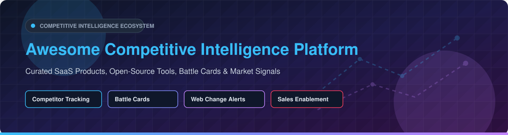

  

# Awesome Competitive Intelligence Platform 🎯

   

## 🌟 Overview & Ecosystem Overview

Welcome to the **Awesome Competitive Intelligence Platform** curated list! 🚀 

**Competitive Intelligence (CI)** platforms and **Market Intelligence (MI)** tools empower Product Marketers, Sales Enablement teams, Executive Leadership, and Strategy teams to track competitor updates, website changes, product releases, pricing pivots, hiring trends, and market signals in real time.

---

## 📈 Market Size & Structure Analysis

> 📊 **Estimated Market Size & Dynamics:**  
> The global **Competitive Intelligence Software Market** is valued at approximately **$2.1 Billion** and is projected to expand to over **$4.8 Billion** by 2030 (CAGR ~12.5%).  
> 
> **Market Fragmentation:** The CI sector is **moderately fragmented**. While legacy financial research and web analytics are dominated by large giants (e.g., AlphaSense, Semrush/Similarweb), specialized B2B competitive enablement (battle cards, win-loss analytics, web change tracking) features vibrant competition among high-growth SaaS players (Klue, Crayon, Contify) alongside a thriving open-source web monitoring ecosystem.

---

## 📑 Table of Contents
- [🏢 SaaS & Commercial Platforms](#-saas--commercial-platforms)
- [🔓 Open-Source GitHub Projects](#-open-source-github-projects)
- [🛠️ Lightweight CI Stack Framework](#%EF%B8%8F-lightweight-ci-stack-framework)
- [🤝 How to Contribute](#-how-to-contribute)
- [☕ Support & Sponsorship](#-support--sponsorship)
- [📈 Star History](#-star-history)
- [⚖️ Disclaimer](#%EF%B8%8F-disclaimer)

---

## 🏢 SaaS & Commercial Platforms

*Top-tier commercial competitive intelligence, battle-card enablement, web monitoring, and market research suites. Sorted by company scale (Revenue / Valuation) in descending order.*

| Platform | Scale (Valuation / ARR) | Specific Starting Pricing | Free Tier / Free Trial Limits | Core CI Capabilities |
| :--- | :--- | :--- | :--- | :--- |
| **[AlphaSense](https://www.alpha-sense.com/)** 💡 | **$4.0B+ Valuation** | Starts at **$300 / user / month** (billed annually) | 2-Week Free Trial (Limited document search quota & select transcript previews) | Market & financial research with AI search across SEC filings, broker research, & expert transcripts. |
| **[Similarweb](https://www.similarweb.com/)** 🌐 | **$850M+ Market Cap** | Starter plan starts at **$125 / user / month** | Free Tier Available (Direct browser extension + 3 months historical website traffic insights) | Digital market intelligence, website traffic analysis, audience overlap, and digital benchmarking. |
| **[Semrush Traffic & Market](https://www.semrush.com/)** 📈 | **$1.8B+ Market Cap** | Pro plan starts at **$139.95 / month** | 7-Day Free Trial (Full Pro features with max 500 domain tracking limit) | Traffic analytics, market explorer, competitor SEO/PPC research, and Kompyte CI lineage. |
| **[Crayon](https://www.crayon.co/)** 🖍️ | **$150M+ Est. Valuation** (~$15M+ ARR) | Custom tiering; Entry Team plans start at **~$12,000 / year** | 14-Day Request Demo / Guided Sandbox Trial (Pre-configured sample battle cards & alert feeds) | AI-powered competitor website tracking, dynamic battle cards, sales enablement, and email digest alerts. |
| **[Klue](https://klue.com/)** ⚔️ | **$150M+ Est. Valuation** (~$20M+ ARR) | Custom tiering; Standard team packages start at **~$15,000 / year** | 14-Day Guided Sandbox Trial (Demo battle card builder & Salesforce/CRM integration preview) | Competitive enablement, deal battle cards, win-loss analysis, and automated competitor news curations. |
| **[Contify](https://www.contify.com/)** 📰 | **$30M+ Est. Valuation** (~$8M+ ARR) | Base starter plan starts at **$300 / month** | 7-Day Free Trial (Access to standard market news feeds & up to 3 customized keyword alerts) | Enterprise market intelligence, curated news aggregation, strategic risk alerts, and custom digests. |
| **[Kompyte](https://www.kompyte.com/)** 🥊 | **Acquired by Semrush** (~$25M Valuation) | Integrated packages start at **$99 / month** | 14-Day Free Trial (Track up to 3 direct competitor domains and generate 1 battle card) | Automated web change tracking, social media monitoring, price alerts, and automated battle card updates. |
| **[Visualping](https://visualping.io/)** stroke | **$20M+ Est. Valuation** | Starter plan starts at **$10 / month** (2,000 checks) | Free Forever Plan (5 checks / day = 150 checks / month, 1 page limit) | Visual website change detection, AI page summarize alerts, and element-level diff monitoring. |
| **[Prisync](https://prisync.com/)** 🏷️ | **$15M+ Est. Valuation** (~$4M+ ARR) | Professional plan starts at **$99 / month** (100 products) | 14-Day Free Trial (Track up to 100 products with automatic price update alerts) | E-commerce competitor price tracking, dynamic pricing engine, and stock/inventory monitoring. |
| **[Wachete](https://www.wachete.com/)** 👁️ | **$5M+ Est. Valuation** | Basic plan starts at **$9.90 / month** (50 pages) | Free Forever Plan (5 monitored pages, re-checked every 24 hours) | Web page monitoring, historical portal diffs, price tracking, and PDF change detection. |

---

## 🔓 Open-Source GitHub Projects

*Self-hosted software, web change monitors, AI intelligence gatherers, and scraping frameworks. Sorted by GitHub_Stars_Count in descending order.*

| Project | GitHub_Stars_Badge | Primary Use Case & CI Capabilities |
| :--- | :--- | :--- |
| **[Playwright](https://github.com/microsoft/playwright)** 🎭 |  | Reliable browser automation & headful/headless web scraping for dynamic competitor SPA monitoring. |
| **[Scrapy](https://github.com/scrapy/scrapy)** 🕷️ |  | High-performance open-source web crawling & data extraction framework for tracking competitor product catalogs. |
| **[changedetection.io](https://github.com/dgtlmoon/changedetection.io)** 🔔 |  | Leading open-source web change detection service—monitor competitor pricing, restock signals, and page edits. |
| **[Spider](https://github.com/spider-rs/spider)** 🕸️ |  | Lightning-fast web crawler written in Rust, built for large-scale market research and domain indexing. |
| **[Awesome-Competitive-Intelligence-Platform](https://github.com/ishandutta2007/Awesome-Competitive-Intelligence-Platform)** 🎯 |  | Curated collection of competitive intelligence platforms, battle-card engines, and market monitoring systems. |
| **[repo-intel](https://github.com/oxnr/repo-intel)** 💻 |  | AI-powered competitive intelligence from GitHub repos—track commit velocity, releases, and developer activity. |

---

## 🛠️ Lightweight CI Stack Framework

Want to build a lightweight, privacy-focused internal CI system without high SaaS recurring costs? Follow this modular workflow:

1. **Web Change Alerts:** Deploy **[changedetection.io](https://github.com/dgtlmoon/changedetection.io)** on self-hosted Docker containers to monitor competitor pricing and landing pages.
2. **Data Scraping:** Write custom scrapers with **[Playwright](https://github.com/microsoft/playwright)** or **[Scrapy](https://github.com/scrapy/scrapy)** for dynamic content and structured pricing extractions.
3. **Developer Signal Tracking:** Run **[repo-intel](https://github.com/oxnr/repo-intel)** to track competitor GitHub release notes and engineering momentum.
4. **AI Summarization:** Feed text diffs and RSS feeds into LLMs (OpenAI, Claude, or local Ollama) to auto-generate weekly competitor updates.
5. **Knowledge Base:** Publish battle cards into Git Markdown, Notion, or internal wikis for sales enablement.

---

## 🤝 How to Contribute

Contributions are highly appreciated! Please follow these simple steps:

1. Fork this repository 🍴
2. Create a new feature branch (`git checkout -b feature/add-new-ci-tool`)
3. Add your entry keeping the exact table format, pricing specificity, and Stars_Badges 📝
4. Commit your changes (`git commit -m 'Add New CI Tool'`)
5. Push to your branch (`git push origin feature/add-new-ci-tool`)
6. Open a Pull Request 🚀

For curated awesome list guidelines, check out [Awesome-Awesome-Awesome](https://github.com/ishandutta2007/Awesome-Awesome-Awesome).

---

## ☕ Support & Sponsorship

If you find this repository valuable for your product marketing, sales enablement, or market intelligence research, please consider supporting the project! 💖

- ⭐ **Star this repository** to help others discover it!
- 🔀 **Fork & Share** it with your colleagues and CI communities!
- ☕ **Buy me a coffee / Sponsor:** [GitHub Sponsors Dashboard](https://github.com/sponsors/ishandutta2007)

Your support keeps this ecosystem up-to-date and continuously expanding! Thank you! 🙏

---

## 📈 Star History

---

## ⚖️ Disclaimer

- This list is **community-curated** for research and educational purposes only.
- Competitive intelligence monitoring must comply with website Terms of Service, `robots.txt`, and applicable legal frameworks.
- Product names, logos, and brands belong to their respective owners.
